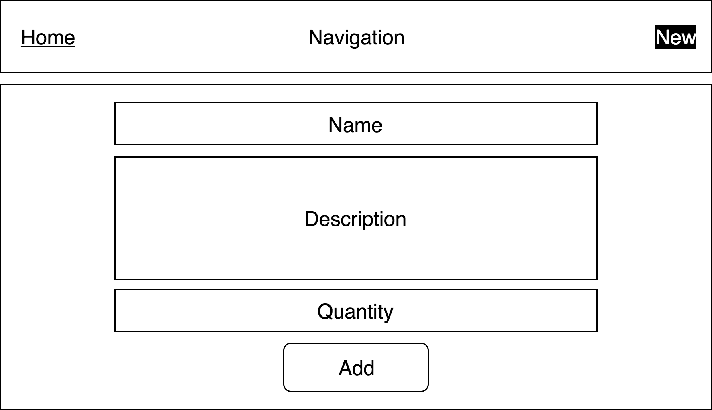

# React Interview Challenge

Build a shopping list web app with React.

## User interface

### Home page:


#### UI elements:
+ Top navigation with links to `Home` and `New` pages. `Home` is highlighted.
+ List of shopping items on the left. Each item has `Delete` button that removes that item from the list.
+ Form for adding a new shopping list item on the right.

### New Item page:



#### UI elements:
+ Top navigation with links to `Home` and `New` pages. `New` is highlighted.
+ Form for adding a new shopping list item in the center of the page.

## Requirements

+ User must be able to view all items, add a new item and delete any item in the list.
+ Use [Create React App](https://github.com/facebookincubator/create-react-app) to create your React app.
+ Use Redux to manage your application's state.
+ Use React Router for routing.
+ Write at least one unit test for React component, action creator function and reducer. Use Jest.
+ Use Sass for styling.

## Specification

Each shopping list item must have:
+ `id` - string, required, generated via API call.
+ `name` - string, required.
+ `description` - string, optional.
+ `quantity` - integer, required.
+ `created_date` - string that represents timestamp, required, generated via API call.

## Routes

Header of your web app must have a navigation between two pages: `Home` page and `New` page.

#### `/` is home page.

`/` should display a list of items in your shopping list.

Home page displays a list of shopping list items on the left and a form for adding a new shopping list item on the right. User can click `Delete` icon on any shopping list item to delete it from the shopping list.

#### `/new` is new item page.

`/new` should display a form for adding a new item to your shopping list.

New Shopping Item page displays a form for adding a new shopping list item.

## API endpoints

Assume you have the following API available for you.

#### GET `/api/v1/items/new` returns a new `id` and `created_date` for new shopping list item.

Response example:

```json
{
  "id": "3",
  "created_date": "2017-07-11T23:55:57.107Z",
}
```

#### GET `/api/v1/items/` returns an array of all items.

Response example:

```json
[
  {
    "id": "1",
    "name": "Milk",
    "description": "",
    "quanity": 1,
    "created_date": "2017-07-11T23:55:57.107Z",
  },
  {
    "id": "2",
    "name": "Water",
    "description": "Still water 2 litres bottle.",
    "quantity": 2,
    "created_date": "2017-07-11T23:56:15.682Z",
  }
]
```

#### DELETE `/api/v1/item/delete`, payload: `{ "id": "1" }` - where `id` is an id of an item you want to delete.

Response example:

```json
{
  "id": "1"
}
```

+ Assume that the API uses standart HTTP reponse codes for success and failure.

## Submit your solution

Upload your solution on GitHub and send a link to the repository. Make sure you can start your application from the `master` branch.
